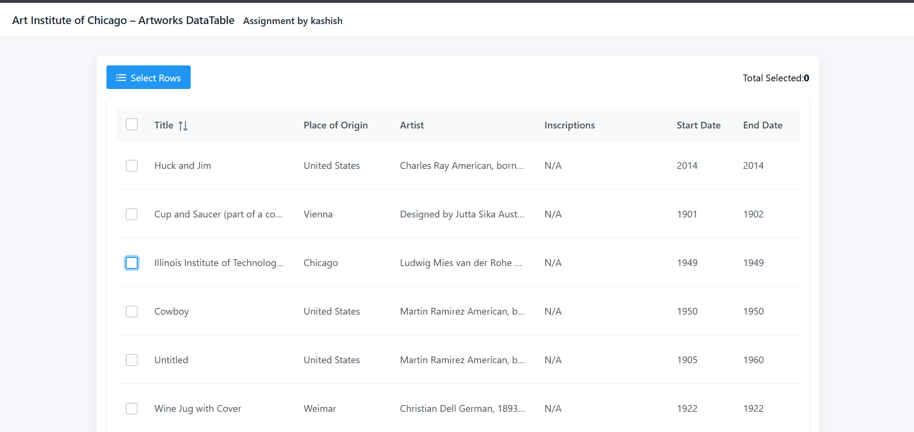
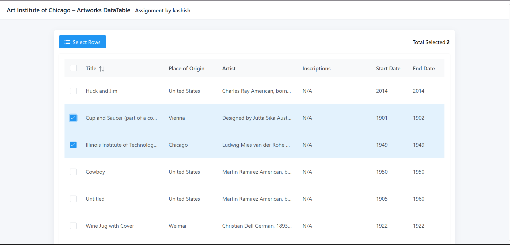

<div align="center">
  <h1>Pagination</h1>
  <p><strong>Reusable pagination demos & components — small examples and utilities to explore pagination strategies in React & TypeScript</strong></p>

  <p>
    
    
    

  </p>

  <p>
    <a href="#features">✨ Features</a> •
    <a href="#examples">🧩 Examples</a> •
    <a href="#installation">⚡ Installation</a> •
    <a href="#usage">▶️ Usage</a> •
    <a href="#contributing">🤝 Contributing</a>
  </p>
</div>

---

## 📖 Project Overview

This repository contains small React projects and examples that demonstrate different pagination techniques and UI patterns. It aims to be a compact learning resource and a starting point for integrating pagination into TypeScript + React applications.

The repo currently includes the `artic-prime-react` example app (Vite). Each example is intentionally small and focused on one pagination approach (client-side, server-side, infinite scroll, cursor-based, etc.), enabling quick experimentation and comparison.

> NOTE: This README is generic and should be updated per-example if you add new demo apps or change languages.

---

## ✨ Features

- Multiple pagination patterns:
  - Client-side pagination (slice + local state)
  - Server-side pagination (page/limit query)
  - Cursor-based pagination (next/prev cursors)
  - Infinite scrolling (intersection observer / React Infinite Scroll)
- Reusable, typed pagination components (TypeScript)
- Small demo apps built with React + Vite for quick local testing
- Minimal, easy-to-read code to learn pagination concepts quickly

---

## 🧩 Examples

- artic-prime-react/
  - A small React + TypeScript demo application (Vite) that integrates UI components and demonstrates one or more pagination strategies.
  - Inspect the folder to find the main entry and the example components.

Typical layout in an example:
- package.json / tsconfig.json — dependencies and TypeScript configuration
- src/ — React + TSX source files
  - components/ — Pagination UI & helpers (strongly typed)
  - pages/ — Demo pages that use the pagination component
  - main.tsx / App.tsx — app entry and router (if present)
- index.html / vite config — tooling

---

## 🛠️ Tech Stack

- Frontend: React (v18+/19) + Vite
- Language: TypeScript (primary) — provides typed components and safer APIs
- Styling: CSS / module CSS / Tailwind (varies per example)

Notes:
- Examples may mix JavaScript and TypeScript files; primary intent is to demonstrate pagination patterns with TypeScript-first components where applicable.
- If you prefer plain JS, TypeScript definitions can be removed or compiled out.

---


## 📸 Screenshots

<div align="center">

### 🏠 Table


### ✍️ Rows


### 📖 Selection


### 📱 Base


</div>

---

## 🚀 Installation

Prerequisites:
- Node.js 16+ and npm (or pnpm/yarn)
- Git

General steps (adapt to the specific demo folder):

1. Clone this repository:
```bash
git clone https://github.com/kashishchadha/pagination.git
cd pagination
```

2. Inspect example folders (for instance `artic-prime-react`) and install dependencies:
```bash
cd artic-prime-react
npm install
```

3. Start the dev server:
```bash
npm run dev
```

4. Open the app in your browser (Vite will show the local URL, typically http://localhost:5173).

---

## ▶️ Usage

- Explore the demo pages in the running app to see how pagination is implemented.
- Look for components named `Pagination`, `Pager`, `InfiniteScroll`, or similar in `src/components/`.
- To reuse the typed pagination component:
  - Import it into your page/component
  - Provide props such as:
    - totalItems?: number (optional for infinite/cursor)
    - pageSize: number
    - currentPage: number
    - onPageChange: (page: number) => void
    - labels / aria props for accessibility

Example (TypeScript pseudocode):
```tsx
<Pagination
  totalItems={100}
  pageSize={10}
  currentPage={page}
  onPageChange={(p: number) => setPage(p)}
/>
```

For server-side pagination, use query params like `?page=2&limit=20` or adopt cursor tokens returned by the API (typed as string | null).

---

## ✅ Suggested Patterns & Tips

- Client-side pagination
  - Good for small datasets (< 2–3k items in-memory)
  - Simple: slice the array for the current page

- Server-side pagination
  - Use when datasets are large or fetching is expensive
  - Prefer page+limit for simple UIs; use cursors for reliable pagination over changing datasets

- Infinite scroll
  - Great UX for discovery-focused interfaces
  - Provide a fallback (e.g., "Load more" button) for accessibility and edge cases

- Cursor-based pagination
  - Prefer when data mutability is high (inserts/deletes) and you need consistent ordering
  - Return a nextCursor (and optionally prevCursor) from the server

- Accessibility
  - Ensure page links and next/prev buttons use semantic elements and aria attributes
  - Provide focus management when content changes

---

## 🧪 Testing & Linting

- If the example includes test scripts, run:
```bash
npm test
```
- Linting (if configured) can be run with:
```bash
npm run lint
```
- TypeScript type checks:
```bash
npm run build
# or
npx tsc --noEmit
```

---

## 📁 Project Structure (example)

```
pagination/
├── artic-prime-react/        # Example React + TypeScript app (Vite)
│   ├── public/
│   ├── src/
│   │   ├── components/       # Reusable components (Pagination, InfiniteScroll, etc.)
│   │   ├── pages/            # Demo pages showcasing pagination patterns
│   │   ├── types/            # Shared TypeScript types and interfaces
│   │   └── main.tsx
│   ├── package.json
│   └── tsconfig.json
├── README.md
└── .gitignore
```

---

## 🤝 Contributing

Contributions welcome — please follow these steps:

1. Fork the repo
2. Create a branch:
```bash
git checkout -b feat/my-pagination-improvement
```
3. Commit your changes:
```bash
git commit -m "Add server-side pagination demo"
```
4. Push and open a PR

Guidelines:
- Keep examples focused and small
- Add/maintain TypeScript types for new components
- Add a README or comment inside an example describing what it demonstrates
- If you add dependencies, document why they are needed

---

## 📝 License

This project is available under the MIT License. See the LICENSE file for details.

---

## 🙏 Acknowledgments

- Pagination UX patterns and community best practices
- React, TypeScript and Vite teams for great dev experience

